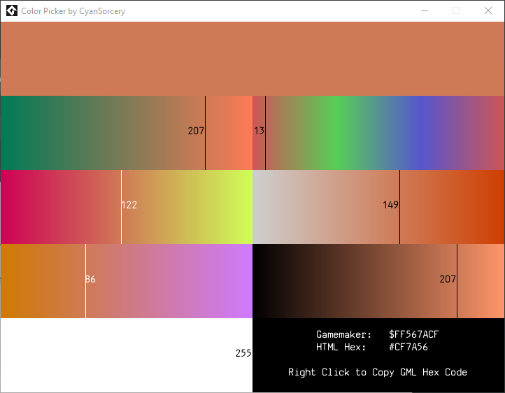

# Gamemaker-Color-Picker
This is a simple color picker for Gamemaker projects that creates Gamemaker color strings for use in projects. The color strings are compatible with any version of Gamemaker.

There are certain display bugs regarding the numbers, but all sliders work. You can change the color using RGB and HSV sliders, as well as change the alpha. Changes are previewed in real time.

When you've picked your color, right click in the window to copy it to your clipboard. An HTML Hexcode is also provided for convenience.

